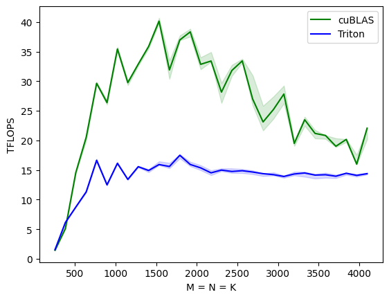
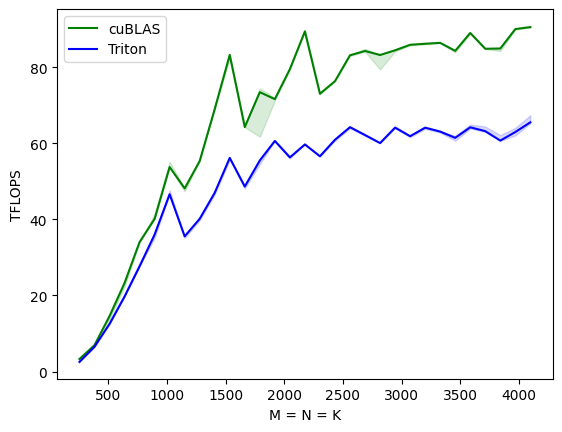

# triton_matrix_multiplication
Benchmarking matrix multiplication with Triton 

Matrix multiplications on GPUs may currently be one of the most important algorithms that exist, considering it makes up almost all the FLOPs during the training and inference of large deep-learning models. They are notoriously hard to optimize, hence their implementation is generally done by hardware vendors themselves as part of so-called “kernel libraries” (e.g., cuBLAS). Unfortunately, these libraries are often proprietary and cannot be easily customized to accommodate the needs of modern deep-learning workloads.  Triton makes one able to implement efficient matrix multiplications by himself.
In this notebook, I benchmark those different implementations of both classical cuBLAS and Triton on different GPUs to highlight the efficiency gains of this library. 

  
